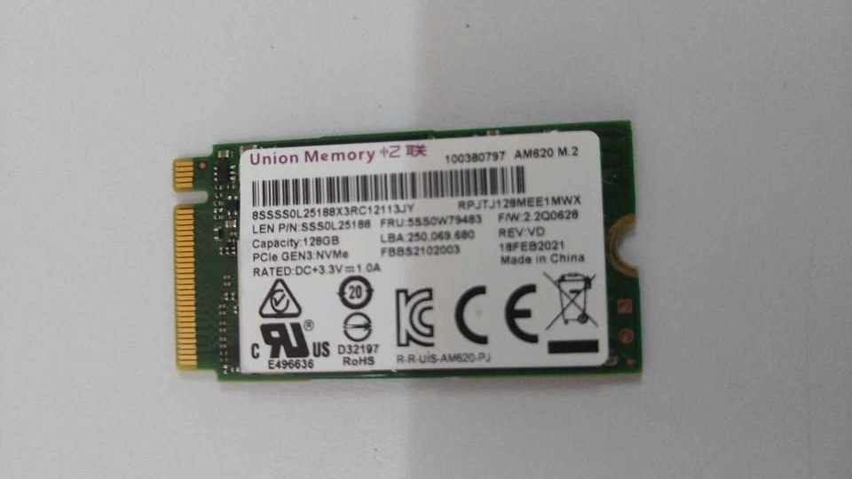
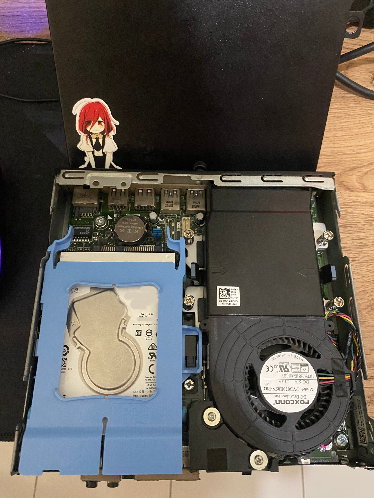
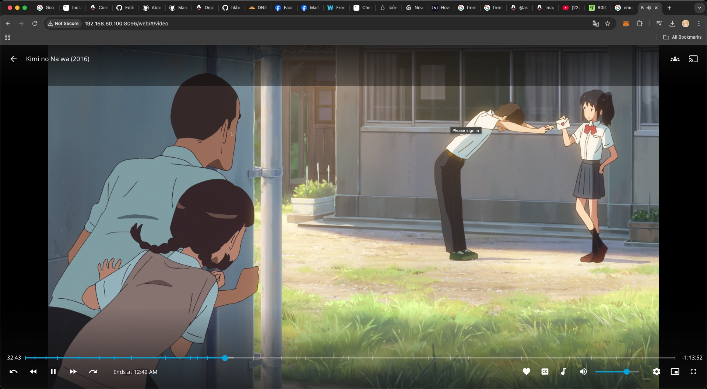
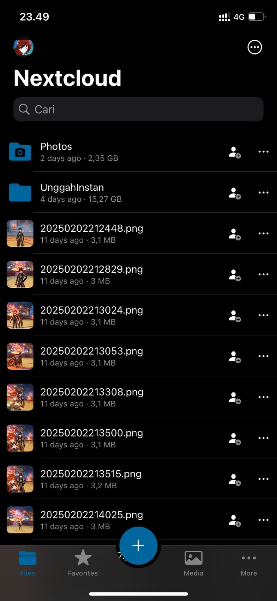

I have been using a `ZTE B860H` (ARM based) for a long time as my Homelab. It's a great device, cheap and less power consumption. I have installed Kodi on it and use it as a media player, Jellyfin for streaming, and uTorrent for downloading. I want to say that ZTE B860H is good, but the main issue is the device encoding performance. It's not good for transcoding. So, I decided to build a new Homelab.

I have been thinking about building a cheap Homelab using a PC. My main PC is `HP EliteDesk 800 G4 SFF` that contains an Intel Core i7-8700, 16GB RAM, and 256GB SSD. I have a plan to use it as a NAS storage, after I bought a new PC. But, the build is too good and I love it (EliteDesk bro). I don't want to use it as a Homelab. So, I have been looking for a cheap PC for Homelab.

## Finding a PC

I have been looking for a cheap PC for Homelab. I have a plan to buy a new PC, but I don't have enough money. I have been looking for a PC on the internet, and I found a `Dell Optiplex 3050`. It's a small form factor PC that contains an Intel Core i3-7100T, 8GB RAM, and 256GB SATA SSD. The price is around 70 USD (secondhand). I think it's a good deal, so I bought it without SSD. I got the real price is 55 USD.

The Dell Optiplex 3050 only have 1x 2.5" SATA slot. This is a bit of a problem because the main operating system must be installed in separate storage. I have a plan to use a 1TB HDD that I have for storage. So, I bought a cheap secondhand 128GB NVME SSD for the main operating system. The price is around 20 USD. The price is around 6.11 USD.

> I don't think about how good the SSD is because it's just for running the operating system (just buy it). But, luckily the SSD is good. It's a `UMIS 128GB`. I have never heard about this brand before. But, I have read that this SSD used in Lenovo Thinkpad. So, I think it's good 😁.

## Building the Homelab

I cannot say that I really build a Homelab or not because it just a PC with a 1 SATA HDD and low spec. The system is not RAID implemented. 

For operating system, I use `FreeBSD 14.2-RELEASE`. I don't run Proxmox because high of loss performance and the processor is not good. I make 3 partitions on the 1TB HDD. The first partition is for `Media` (anime and movie), the second partition is for `Data` (cloud storage), and the third partition is for `Secret` (personal files) with just personal files partition encrypted with `GELI`. In other hand, the 128GB NVME SSD is used for the operating system. All of the partitions filesystem is `ZFS`.

The main application are installed inside jail. What I mean here is that I don't install the application directly on the host. I use `bastille` for jail management. I have installed `Jellyfin`, `Radarr`, `Sonarr`, `Lidarr` on same jail while I separate `Nextcloud` in different jail.

## Result

I have installed Jellyfin for streaming. The encoding performance is good than ZTE B860H. The Kodi performance is also good. I can play UHD video without any problem (in ZTE B860H, I must waiting the video encoded first or buffering).
 
 
 
I also installed Nextcloud for cloud storage (and I love it). The main problem installing Nextcloud in FreeBSD more complex than in Linux. I have to install `PHP`, `Postgres`, `Nginx`, and `Nextcloud` itself including activating the `PHP extension` and configuring all of it.

I dont make my homelab as hosting server. I just use it for personal use. The main problem is internet connection in the dorm I live in is too bad (20 Mbps). For public access, I planned to use wireguard for VPN, connecting to my VPS.

## Conclusion

Dell Optiplex 3050 is a good PC for Homelab. The price is cheap, and the performance is good enough for personal use with low power consumption than others. But, the main problem is the storage. The PC only have 1 2.5" SATA slot. For now, big HDD storage like 10 TB only available in 3.5" form factor. I'm sure that HP EliteDesk 800 G4 SFF is better than Dell Optiplex 3050 for homelab server (it contains 3 SATA slot and 2 M.2 slot).

My homelab build is enough for personal use. I can stream video, and cloud storage. The performance is good enough for me. I am happy with my homelab, and I have learned a lot from using it.

`// END`