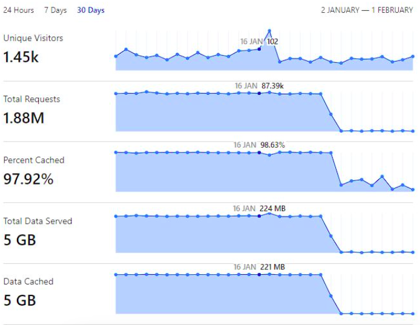
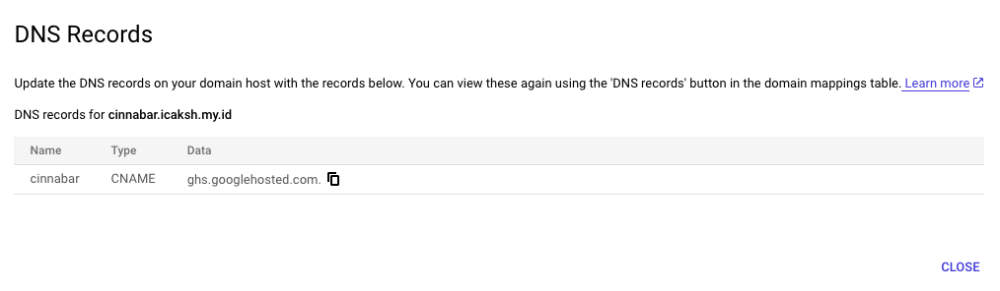
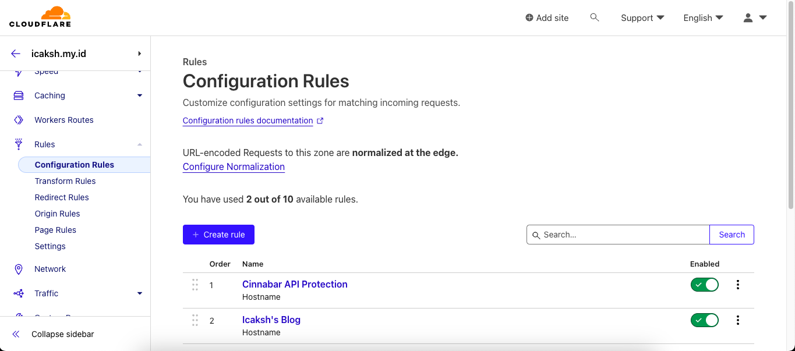
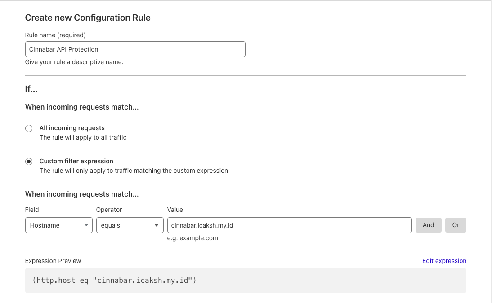
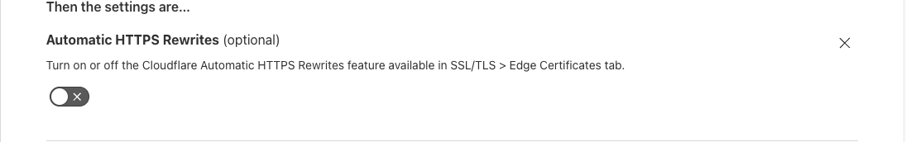
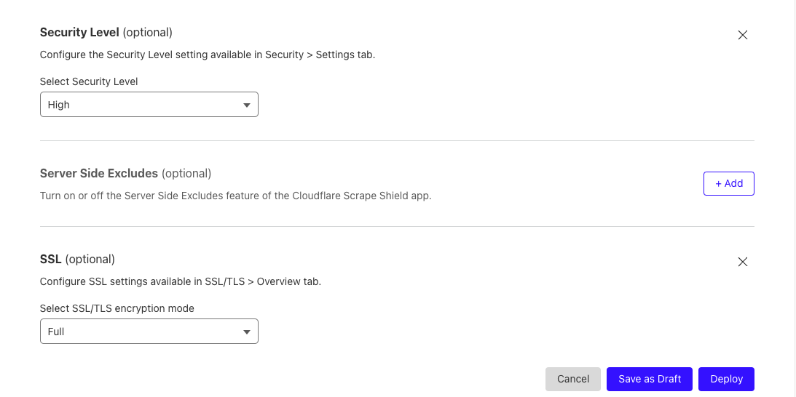
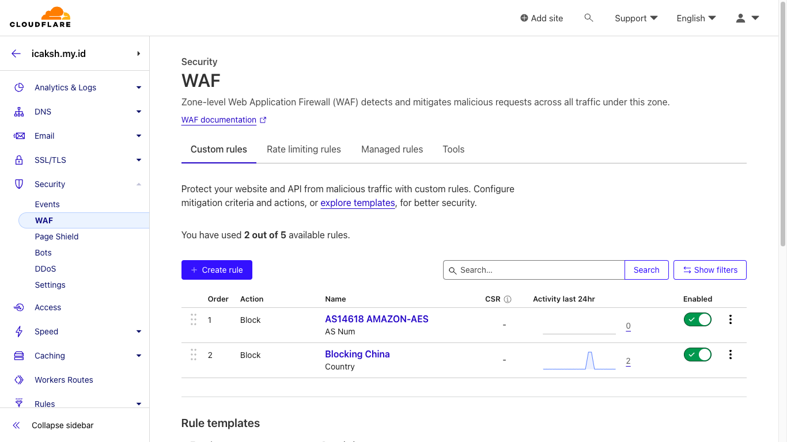
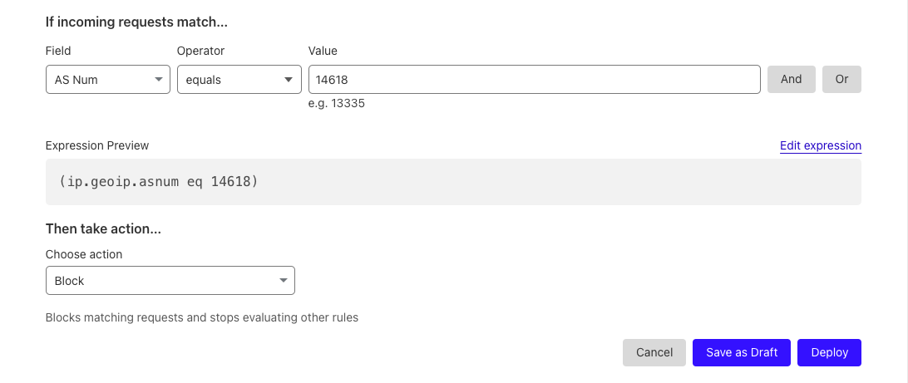
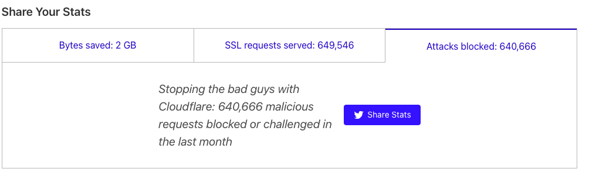

I have a simple REST API deployed on Cloud Run. The application is simple, just checking daily facts from Wikipedia. Well, since I have a high open-source spirit (wkakakak), I decided to add one feature that I think is not too crucial before I publish the source code. The feature is Check the Latest Earthquake Information. Why did I choose Cloud Run? It's free up to 2 million requests per month, easy to deploy, cheap (I only pay less than 150 IDR (0.01 USD) per month for Golang apps. However, there is one problem that I encountered.

In 2023, I got a pretty big DDoS attack. Actually, it's not a DDoS, but there is a user who accesses the API with a request count per second. Unfortunately, I only realized this when the end of the month and my Cloud Run bill skyrocketed. The plot twist of the attack is that the attack accessed the Latest Earthquake API which is not too crucial.

## Pointing Domain to Cloud Run

Cloud Run by default doesnt have DDoS protection. The original DDoS protection in Google Cloud is Cloud Armor. However, Cloud Armor is not free. I have to pay for the Cloud Armor service. I use Cloudflare as a free DDoS protection service, so I decided to use Cloudflare to protect my Cloud Run.

First, we need to add domain to Cloudflare.
1. Add domain linked on Cloud Run to Cloudflare.

2. In `Cloudflare DNS`, go to `Rules` > `Configuration Rules` and `+ Create Rules`

3. Fill the configuration as follows:
   - Fill the Rule Name
   - Checklist `Custom filter expression`
   - Set `When incoming requests match` to `Hostname` `equals` `yourdomain.com`
   
   - Set `Then the settings are` to `Automatic HTTPS Rewrites` `Off`, `Security Level` `High`, `SSL/TLS` `Full`
   
   
   - Click `Deploy`

## Enable WAF

Remember my REST API that was accessed with a request count per second?. In the Cloud Run log, I saw that the request came from an IP owned by Amazon. Well, at first I thought that I could just block the IP. However, after checking further, it turns out that the request IP keeps changing. As a DevOps, I know that the IP will keep changing. Instead of thinking about the IP + CIDR, I just block the Amazon ASN 😁.

1. In `Cloudflare`, go to `Security` > `WAF` then `+ Create Rule`

2. For example, I will block Amazon ASN. Fill the configuration as follows:
   - Fill the Rule Name
   - Set `Expression` to `ASN Num` `equals` `AS16509`
   - Set `Action` to `Block`
   - Click `Deploy`

## Result

Now, my Cloud Run is protected by Cloudflare. I have added the domain to Cloudflare and enabled WAF to block the Amazon ASN.

> Remember to turn on the Cloudflare orange cloud to enable the Cloudflare proxy. If you don't turn on the orange cloud, Cloudflare won't protect your Cloud Run.

`// END`