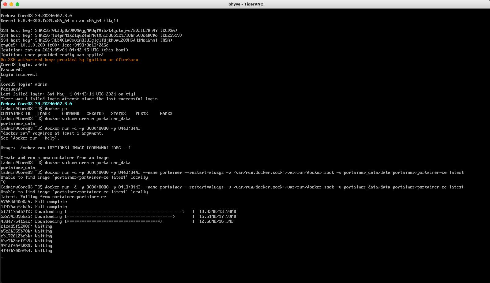
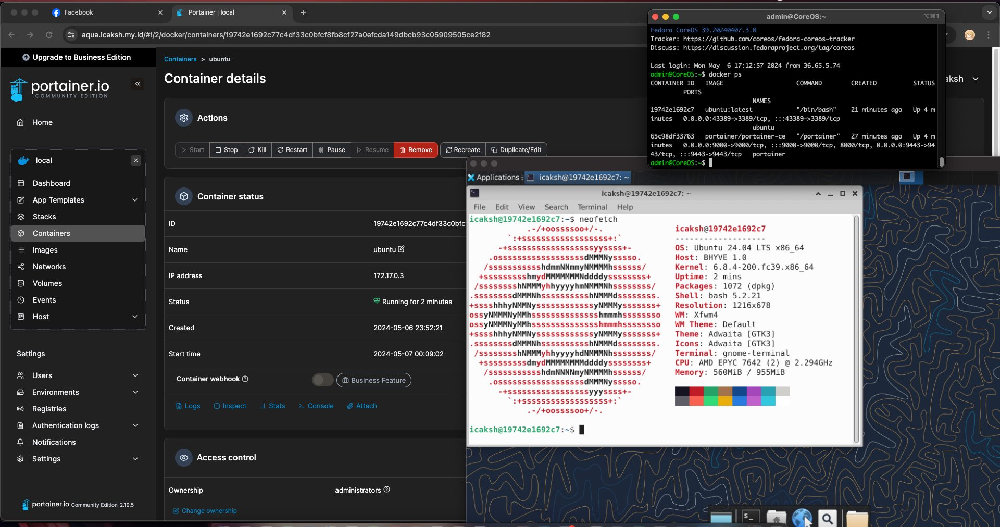

> [!NOTE]
> This post is about how I run Docker on FreeBSD. I hope you find it interesting.

As a DevOps engineer, I often use `Docker` to containerize applications. Docker is a great tool for managing containers, and it makes it easy to deploy applications in a consistent and reproducible way. I have been using Docker for a long time, and I am very familiar with it. 

Before [I porting Nginx Proxy Manager to run on FreeBSD](https://github.com/icaksh/freebsd-nginx-proxy-manager), I have to run it on Docker. I use it to manage my reverse proxies, and it makes it easy to set up SSL certificates and manage multiple domains. I have been using it on Linux, and I wanted to see if I could run it on FreeBSD. The bad news is `Nginx Proxy Manager` runs on Docker, and FreeBSD does not support Docker natively. So, I must find a way to run Docker on FreeBSD.

## Running Docker on FreeBSD

The best way to run Docker on FreeBSD is to use a Linux virtual machine. I use `bhyve` as a hypervisor to run a Linux virtual machine.

```
+-----------+          +------------+          +----------------+
| FreeBSD   | -------- | bhyve      | -------- | Fedora CoreOS  |
+-----------+          +------------+          +----------------+
                                                        |
                                               +----------------+
                                               | Docker Engine  |
                                               +----------------+
```

The architecture is simple. I run a `Fedora CoreOS` virtual machine on `bhyve`, and I install `Docker Engine` on it. For easier installation, I use `vm-bhyve` to manage the virtual machine. Why Fedora CoreOS? Because it's designed for running containerized workloads. It's optimized for running containers, and it comes with Docker Engine pre-installed. 


```
+-----------+          +------------------------+          +----------------+
| User      | -------- | Host                   | -------- | Fedora CoreOS  |
| 10.42.1.1 |          | 172.16.0.1:40000-50000 |          | 192.168.10.1:x |
+-----------+          +------------------------+          +----------------+

```

In my VPS, I only have 1 IPv4 address, so I allocate ports `40000-50000` from the host to the virtual machine. I use `pf` to configure port forwarding. Then, in Docker, I only port forward to the ports in range `40000-50000` in the virtual machine.




## Managing Docker Containers

Originally, to manage the Docker containers, we must access the virtual machine with `ssh` or `vnc`. For easier management, I use `portainer` to manage Docker containers. Portainer is a lightweight management UI that allows you to easily manage your Docker containers, images, networks, and volumes. It's a great tool for managing Docker, and it makes it easy to deploy and manage containers. For testing, I run `Ubuntu` with `XFCE4` desktop environment on Docker including `xrdp` for remote desktop and here is the result.



```
+-----------+---------+-----------+---------+-----------+
| FreeBSD   | Bhyve   | Fedora    | Docker  | Ubuntu    |
+-----------+---------+-----------+---------+-----------+
```

## Known Bug

I have a problem with `bhyve` that the internet connection is too slow. The guest os always got terrible network internet speed (average in 2 Mbps) when the host internet speed average is 1 Gbps. I have tried using debian, alpine, and fedora coreos and it always got terrible network speed.

The solution is to disable `tcp segmentation offload` and `tcp checksum offload` in the host os. Disabling that in the host os will fix the problem, but will make the host speed is not maximum to max (fast enough). Here is the command to disable it.

```sh
ifconfig xxx -txcsum -rxcsum -tso -lero
```

That solution I found in [this post](https://forums.freebsd.org/threads/bhyve-network-performance-is-horrible.93328/).

## Additional Notes

Running Docker on FreeBSD is not as straightforward as running it on Linux. But, with a little bit of effort, you can run Docker on FreeBSD using a Linux virtual machine. I have been using this setup for a while, and it works well for me. I can run Docker containers on FreeBSD and manage them easily using Portainer. 

This setup is recommended for running Docker on FreeBSD? I can say, NO. I prefer to buy another VPS with Linux installed. That's the best way to run Docker. But, if you have a VPS with FreeBSD installed, you can use this setup to run Docker.

`// END`