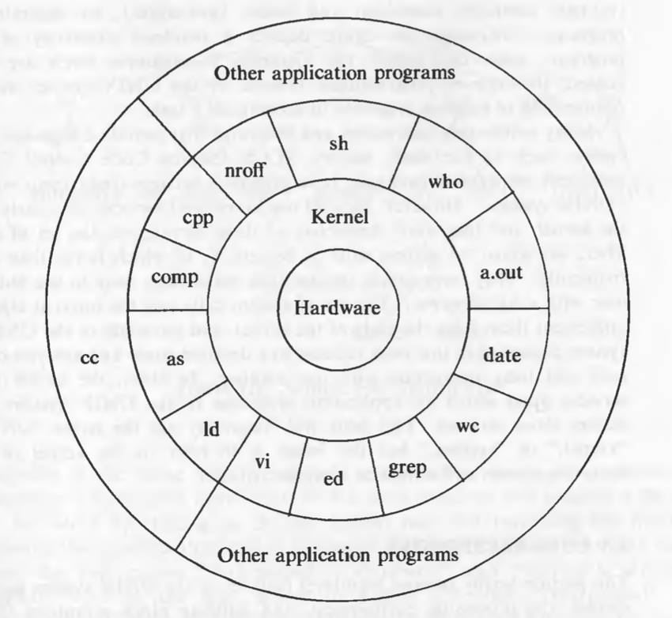
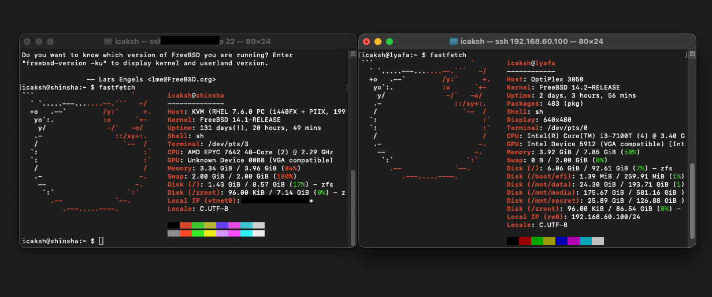

> This post is about my journey with FreeBSD, how I started using it, and my experience with it. I hope you find it interesting.

I first using FreeBSD in 2021, or perhaps even earlier, while experimenting on DigitalOcean in 2015/2016. At that time (2021), I used Google Cloud Engine as a platform to try it out. I cannot recall the exact date, but I distinctly remember using FreeBSD 12 back then. I eventually **gave up** due to the configuration files being different from those in Linux (which I will discuss later).

## Why FreeBSD?

I remember when Debian deciding to use systemd as the default init system. I was confused and didn't like it. When Ubuntu forced me to use snaps, I was also confused. I wanted to use an operating system that respects my freedom and doesn't force me to use something I don't like. Surely, I hate that kind of thing. In an article, I have read that 10,000 lines code in systemd is just for init when in FreeBSD it's make a complete system. I was interested in that. FreeBSD pays great attention to the optimization of its code. 

I have always been interested in UNIX-like operating systems. I have used Linux for a long time, and I wanted to try something different. I have heard a lot of good things about FreeBSD, such as its stability, security, and performance. I also wanted to learn more about the BSD family of operating systems. I also read an article that FreeBSD is more stable than Linux, and it is used in many critical systems. I was intrigued by the idea of using an operating system that is known for its reliability and security. I decided to give it a try and see how it compares to Linux.

## My Experience

When I first started using FreeBSD, I was impressed by how easy it was to install. The installation process was straightforward, and I had no issues setting up my system. I was able to install all the software I needed using the package manager. But, I was a bit stressed because this operating system is different from Linux. I remember that I had to overnight to make touchpad, webcam, sound, and other things work. That's was a bit frustrating. I had to learn about ACPI, devd, and other things that I didn't know before, loading a kernel module, and so on.

I also had to get used to the different directory structure and file system layout. But, I like the structure of the FreeBSD system. I love the `/usr/local/` directory, which is used for installing software from ports. I also like the `/etc/rc.conf` file, which is used for system configuration. I found it easier to manage system configuration files in FreeBSD than in Linux.

FreeBSD Handbook is a great resource for learning about FreeBSD. I have learned a lot from it. I also found the FreeBSD forums and mailing lists to be helpful and I love their jokes. The article from [vermaden](https://vermaden.wordpress.com/) is also a great resource for learning about FreeBSD. I have learned a lot from his blog.

I also create a review of FreeBSD on my Youtube channel. But, it's in Indonesian. You can watch it. 

<iframe width="100%" height="468" src="https://www.youtube.com/embed/Zwr-1OoGzGM" title="YouTube video player" frameborder="0" allowfullscreen></iframe>

## What I Love About FreeBSD

FreeBSD is a `real UNIX` operating system. It is based on the original UNIX codebase and is POSIX compliant. What I mean here is that FreeBSD already encompasses the entirety of an operating system's needs. We know that Linux is essentially just a kernel, which is the core of an entire operating system. Whereas FreeBSD includes the entire operating system itself. So, FreeBSD is a complete operating system.

> FreeBSD is `UNIX-like` because it is not certified by The Open Group as a UNIX operating system.

As someone who has experienced the stability of CentOS, I find FreeBSD to be even more stable. I remember when I use Debian 7, it's not stable like CentOS 6. I actually like Linux, but the frequently changing kernel versions make me uneasy. Additionally, while systemd has been helpful to me, it doesn't seem suitable for my cheapest, minimalist, and poor servers. Moreover, because FreeBSD is a real operating system, it is free from third-party interests that might have their own agendas. I still remember when the Linux community split into two: those who supported systemd and those who did not.

As someone who has used Linux, I feel that there are too many distributions. Many distributions, many tutorials, many documentations, many package managers, many configurations, many everything. I don't mind having many distributions, but please, come to an agreement to unify the configuration files. Especially now, there are distributions that store configuration files in different paths, which is quite confusing.

FreeBSD is essentially a community consisting of many people. Within FreeBSD, there is a core team made up of 10 individuals chosen by the community. This core team decides the direction of FreeBSD's development. Therefore, FreeBSD does not belong to a single person or company, but to the community.

Why democratic? Every commit to the Linux kernel must be approved by Linus Torvalds. This is not the case with FreeBSD. The core team is responsible for approving commits. This is a good thing because it means that the development of FreeBSD is not dependent on a single person. If Linus Torvalds is gone, who will approve the commits? This is a question that has been asked many times.

> I still use Linux for certain purposes, such as in DevOps (docker). It must be acknowledged that Linux has advanced further than FreeBSD, especially in terms of hardware support and ease of use. I sometimes still grumble because **ath10k** still doesn't have a driver.

## Now What?

Today, when I write that article, I use FreeBSD 14.2-RELEASE on my local NAS storage and my VPS. I have been using FreeBSD for a long time, and I have no plans to switch back to Linux except for AI and DevOps. I am happy with FreeBSD, and I have learned a lot from using it (even if I got a headache).

For my daily driver, I use MacOS for its simplicity and ease of use. In fact, MacOS contains a little bit of FreeBSD code. So, I can say that I am still using FreeBSD, but in a different form 😄.

>  I want to be a FreeBSD contributor, but I still have a lot to learn. I hope that I can contribute to the FreeBSD community in the future.